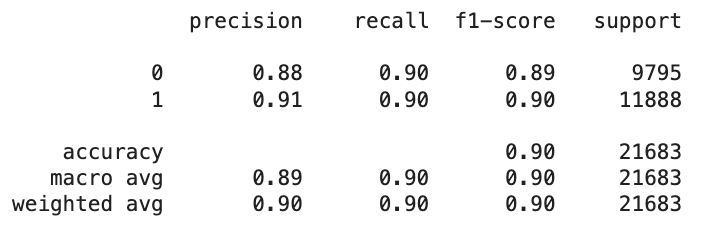

# Internet Service Provider Customer Churn Project

This project aims to predict customer churn using the **Internet Service Churn** dataset from Kaggle ([link](https://www.kaggle.com/datasets/mehmetsabrikunt/internet-service-churn/data)). The analysis includes data loading, cleaning, feature engineering, and a comprehensive evaluation of various machine learning models.

## Table of Contents
1. [Project Overview](#project-overview)
2. [Data Loading](#data-loading)
3. [Feature Analysis](#feature-analysis)
4. [Data Cleaning](#data-cleaning)
5. [Feature Engineering](#feature-engineering)
6. [Model Analysis](#model-analysis)
7. [Model Optimization](#model-optimization)
8. [Visualizations](#visualizations)
9. [Future Work](#future-work)
10. [Contact](#contact)

## Project Overview
The main objective is to build a robust churn prediction model using machine learning techniques on the **Internet Service Churn** dataset. The process includes detailed **Feature Engineering** steps such as **Categorical Encoding**, **Creating New Features**, **Dropping Unnecessary Columns**, **Feature Scaling & Standardization**, **Feature Selection**, and **PCA**.

Modeling techniques include:  
- **Hyperparameter Optimization Models**: RandomForest, XGBoost, LightGBM, CatBoost  
- **Neural Network Models**: PyTorch, Keras  
- **LLM Models**: GPT-4 Turbo, LangChain for generating reports

Visualizations are primarily in **Feature Analysis** and **Model Optimization**, while other sections focus on data outputs and performance metrics.

## Data Loading
In this section, we load and explore the raw data to understand its structure, types of variables, and basic statistics using the following scripts:

- **Unassign_the_Runtime_for_Resetting.py**: Resets the runtime environment to clear cached variables and avoid data conflicts.
- **Upload_the_data.py**: Loads the dataset and performs initial data checks, including missing values and data types.
- **Definitions_for_the_Columns.py**: Provides detailed descriptions and definitions for each column to enhance data understanding.
- **Heatmap.py**: Visualizes the correlation between features to identify potential relationships and redundant variables.

### Key Steps:
- Initial data exploration: Checking for missing values, data types, and class distribution.
- Summary statistics for numerical and categorical features.
- Visualization of correlations and target distribution using heatmaps.

## Feature Analysis  
We examine relationships between features and churn to identify key predictors using the following scripts:

### Heatmap of Correlations  
The heatmap below shows the correlation between different features and the `churn` variable, helping to identify the most relevant variables for analysis.

### Why These Variables?  
The selected variables were chosen based on their correlation strength:

- **Remaining Contract**: Strong negative correlation (-0.63) with churn, indicating that longer contracts reduce churn risk.
- **Subscription Age**: Customers with a higher subscription age are less likely to churn.
- **TV Subscriber** and **Movie Package Subscriber**: Moderate negative correlations, suggesting higher engagement for subscribers.
- **Download and Upload Averages**: Positively correlated with each other but weakly related to churn.

### Key Takeaways:
1. **Remaining Contract** and **Subscription Age** are top predictors.
2. **TV Subscriber** and **Movie Package Subscriber** indicate strong customer engagement.
3. **Bill Average** shows low correlation, making it less useful for churn prediction.

### 1. Analysis of Churn-Related Variables
- **Boxplot_for_Numerical_Variables.py**: Uses boxplots to detect outliers and understand key numerical features' spread.
- **Distribution_plot_for_Numerical_Variables.py**: Analyzes numerical feature distributions, highlighting differences between churned and non-churned customers.
- **Stacked_bar_plot_for_Categorical_Variables.py**: Visualizes the distribution of categorical variables and their impact on churn using stacked bar plots.

### Visualizations
1. **Boxplot Analysis**:
   - **Remaining Contract vs Churn**  
     Shorter contracts correlate with higher churn: Churned users typically have shorter remaining contracts. 
     Outliers: Some churned users have long contracts, but they are rare.
     
   - **Download Average vs Churn**  
     Most users have low internet usage: Both churned and non-churned users show similar low usage levels.
     Outliers exist, but no clear trend: High-usage outliers appear, but no strong correlation between usage and 
     churn is observed.
     

2. **Distribution Analysis**:
   - **Remaining Contract by Churn**  
     Churned users (orange): Most have almost no remaining contract time, indicating they churn near the 
     contract's end.
     Non-churned users (blue): Their contract lengths are more evenly distributed, suggesting less correlation 
     between contract length and retention.
 
     
   - **Download Average by Churn**  
     Most users (churned and non-churned) have low average internet usage, clustered near zero.
     No clear distinction between churned and non-churned users based on internet usage, as both d  
     

3. **Stacked Bar Plot Analysis(Categorical Variable)**:
   - **TV Subscriber vs Churn**  
     Non-TV subscribers: Higher churn rate compared to non-churned users. TV subscribers: Lower churn rate with 
     more non-churned users. Overall, TV subscribers are less likely to churn than non-TV subscribers.
     

   - **Movie Package Subscriber vs Churn**  
     Non-movie package subscribers: Higher churn rate with a greater proportion of churned users. Movie package 
     subscribers: Lower churn rate, with more non-churned users. Movie package subscribers are less likely to 
     churn than non-subscribers. 
     
     
### 2. Correlation Between Variables
We explore pairwise relationships between numerical features to identify significant patterns and dependencies using scatter plots and jointplots.

### Visualizations
1. **Scatter Plot Analysis**:
   - **Download Avg vs Upload Avg**  
     Low value concentration: Most users have low download and upload averages. Positive correlation: Higher 
     download averages generally align with higher upload averages, though less consistent at high values.
     

   - **Download Avg vs Bill Avg**  
     Concentration at lower values: Most users have both low download averages and low bills, clustering in the 
     bottom-left corner. Weak positive correlation: Higher downloads tend to result in higher bills, but 
     inconsistently.
     

2. **Jointplot Analysis**:
   - **Download Avg and Upload Avg**  
     Low value clustering: Most users have low download and upload averages, concentrated in the bottom-left 
     corner. Positive correlation: As download averages increase, upload averages also rise, though the 
     correlation weakens at higher values. 
     

   - **Download Avg and Bill Avg**  
     Low value concentration: Most users have low download and upload averages, as shown by the cluster in the 
     lower left. Outliers: A few users have higher averages, but they are less common.  
     

## Data Cleaning  
Cleaning the dataset to ensure data consistency and improve model performance using the following script:
- **Handling_Missing_Value.py**: Visualizes distributions of columns with missing values and fills them using **median imputation** for numerical features to maintain data consistency.
- 
It helps ensure a consistent and clean dataset, minimizing data-related issues during modeling.

## Feature Engineering  
Creating and transforming features to enhance predictive power using the following scripts:

- **Dropping_Unnecessary_Columns.py**: Identifies and removes redundant or irrelevant features to simplify the dataset and reduce model complexity.

- **Creating_New_Features.py**: Creates new features such as **contract status**, **subscription combinations**, **usage categories**, and **interaction terms** to capture complex relationships and enhance predictive power.

- **Categorical_Encoding.py**: Uses **One-Hot Encoding** to convert categorical variables into numerical format and transforms `True/False` values to `0/1` for model compatibility.

- **Feature_Scaling_Standardization.py**: Applies **StandardScaler** to standardize numerical features, ensuring they are on a consistent scale for improved model performance.

- **Feature_Selection.py**: Uses correlation analysis to remove highly correlated or irrelevant features, optimizing model performance.

- **Heatmap.py**:  Visualizes correlations between features using heatmaps to identify multicollinearity and guide feature selection.

- **PCA.py**:  Applies Principal Component Analysis to reduce dimensionality, retaining essential information while minimizing noise and redundancy.

These steps ensure that the dataset is well-prepared, with transformed and optimized features for improved model performance.

## Model Analysis  
Building and evaluating different machine learning models using the following scripts:

- **Split_training_and_test_sets.py**:  Splits the dataset into training, validation, and testing sets using a 70-30 split strategy for train+validation and test sets, and further splits the train+validation set into separate training and validation sets.  
  - Data distribution:  
    - **Training set**: 35,413 samples  
    - **Validation set**: 15,178 samples  
    - **Test set**: 21,683 samples  

  - Class distribution:  
    - **Training set**:  
      - Churn: 19,609  
      - Non-Churn: 15,804  
    - **Validation set**:  
      - Churn: 8,553  
      - Non-Churn: 6,625  

- **Train_the_model.py**: Trains models such as **Logistic Regression** and **Random Forest** using training data.  
  - **RandomForestClassifier**:  
    - Evaluated using cross-validation on the training set, achieving consistent performance scores around 0.89 across 5 folds.  
    - Predicted results on the test set with a **precision** of 0.88 (non-churn) and 0.91 (churn), and an **overall accuracy** of 90%.

  
  - **Logistic Regression**:  
    - Scaled features using **StandardScaler** to ensure consistent feature distribution.  
    - Achieved a **precision** of 0.87 (non-churn) and 0.80 (churn) on the test set, with an **overall accuracy** of 82%.  

Each model is evaluated using metrics such as **accuracy**, **precision**, **recall**, and **F1-score** to assess classification performance and compare results.

## Model Optimization  
Optimizing different models to achieve the best performance using the following scripts:

### Hyperparameter Optimization  
Fine-tuning various models to achieve optimal performance using the following scripts:

- **Randomforest_Hyperparameter_Optimization.py**:  
  - Uses **RandomizedSearchCV** with a focused parameter grid to quickly explore combinations for `n_estimators`, `max_depth`, and `min_samples_split`.  
  - Best Parameters: `{'n_estimators': 100, 'min_samples_split': 2, 'max_depth': 15}`  
  - Best Score: **0.897**

- **Xgboost_Hyperparameter_Optimization.py**:  
  - Utilizes **GridSearchCV** to refine `max_depth`, `n_estimators`, and `learning_rate` for XGBoost.  
  - Best Parameters: `{'learning_rate': 0.05, 'max_depth': 10, 'n_estimators': 100}`  
  - Best Score: **0.898**

- **Lightgbm_Hyperparameter_Optimization.py**:  
  - Adjusts parameters such as `max_depth`, `n_estimators`, and `learning_rate` using **GridSearchCV**.  
  - Includes `scale_pos_weight` to handle class imbalance.  
  - Best Parameters: `{'learning_rate': 0.1, 'max_depth': 10, 'n_estimators': 100}`  
  - Best Score: **0.898**

- **Catboost_Hyperparameter_Optimization.py**:  
  - Leverages **GridSearchCV** with early stopping to fine-tune `depth`, `iterations`, and `learning_rate`.  
  - Best Parameters: `{'depth': 5, 'iterations': 80, 'learning_rate': 0.1}`  
  - Best Score: **0.876**

These scripts optimize each model's hyperparameters, improving their predictive power and reducing overfitting.

### Neural Network Models (NN Model)  
Implementing neural networks using PyTorch and Keras to capture complex patterns in the data:

- **Pytorch.py**:  
  - Builds a neural network with custom layers and batch normalization to improve convergence.  
  - Incorporates **early stopping** and a **learning rate scheduler** to optimize training efficiency.

### Model Performance on Test Set  
- The model achieves a precision of **0.79** for non-churn and **0.89** for churn, with an overall **accuracy** of **84%**.  
- Balanced precision and recall show that the model handles both churned and non-churned customers effectively, without favoring one class over the other.  

### Training and Validation Loss Over Epochs  
The model stopped training at **epoch 9** due to rising validation loss, indicating the onset of overfitting. Peak validation accuracy reached **87.3%**, highlighting good generalization and effective early stopping.  

### Key Features of the PyTorch Model  
- **Batch Normalization**:  
  - Applied after each hidden layer to stabilize training and reduce sensitivity to weight initialization.  
- **Early Stopping**:  
  - Prevents overfitting by monitoring validation loss and stopping training when no improvement is seen after several epochs.  
- **Learning Rate Scheduler**:  
  - Dynamically reduces the learning rate if validation loss plateaus, enabling smoother convergence.

### PyTorch Model Results  
- The final model achieved an **accuracy of 84%** on the test set with an **F1-score** of 0.84.  
- Precision and recall are well-balanced, suggesting that the model performs consistently across both classes.  

### Keras Model Analysis  
- **Keras.py**: Implements a Keras model using the TensorFlow backend, applying **dropout layers** for regularization and a custom **focal loss** function to address class imbalance.

### Keras Model Performance  
- The Keras model achieved a **test accuracy of 91%** and an **F1-score of 0.91**, indicating strong predictive performance on the churn dataset.  

### Training and Validation Accuracy Trends  
The training and validation accuracy steadily improved over 50 epochs, stabilizing around epoch 41, with validation accuracy consistently above 90%. This trend reflects effective learning and minimal overfitting.

### Model Summary  
The neural network models in this section employ techniques such as dropout, Batch Normalization, and early stopping to optimize performance and generalization on the churn prediction problem.

### LLM Models (Large Language Models)  
Implementing Large Language Models (LLMs) to automate report generation and enhance data analysis insights:

- **OpenAi_Langchain_setup.py**:  
  - Configures OpenAI and LangChain settings for seamless integration.  
  - Demonstrates the installation and setup of the required libraries.

- **GPT-4_Turbo_report.py**:  
  - Generates detailed insights and churn risk summaries using **GPT-4 Turbo**.  
  - Implements a script to create personalized reports for high-risk customers, focusing on contract duration, 
    data usage, and churn probability.

- **Langchain_reports_for_each_Risk_Level.py**:  
  - Utilizes **LangChain** to create distinct report templates for **High**, **Medium**, and **Low** churn risk 
    levels.  
  - Uses separate prompts and configurations to generate personalized suggestions for each risk category.

The optimization process includes hyperparameter tuning, cross-validation to prevent overfitting, and leveraging feature importance to refine the final models.

## Visualizations
All visualizations used in the project are stored in the `images` folder. Key plots include:
- Boxplots for numerical feature distributions.
- Correlation heatmaps.
- Loss curves for training and validation.
- ROC-AUC curves for model evaluation.

## Future Work
1. **Additional Feature Engineering**: Exploring interaction features and time-based variables.
2. **Deployment**: Creating a real-time dashboard for monitoring customer churn.

## Contact  
For any questions or collaboration opportunities, please reach out to:

**Cindy Lin**  
[GitHub Profile](https://github.com/cindy12651269)  
[Google Colab Project Link](https://colab.research.google.com/drive/1kxXXuma3LAnyrTI5X3bBtUDDZsM_Gagf#scrollTo=SV_B-pk9gL-3)  

